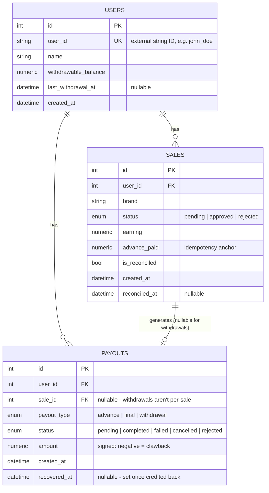

# Database Schema

## Entity-Relationship Diagram

## Table: `users`

| Column | Type | Constraints | Purpose |
|---|---|---|---|
| `id` | `INTEGER` | PK, autoincrement | Internal surrogate key |
| `user_id` | `VARCHAR(100)` | UNIQUE, NOT NULL, indexed | External identifier matching the assignment's reference data (`"john_doe"`) |
| `name` | `VARCHAR(255)` | NOT NULL | Display name |
| `withdrawable_balance` | `NUMERIC(12,2)` | NOT NULL, default `0` | Running ledger balance available to withdraw |
| `last_withdrawal_at` | `TIMESTAMPTZ` | nullable | Used to enforce the 24-hour withdrawal cooldown |
| `created_at` | `TIMESTAMPTZ` | NOT NULL | Audit timestamp |

## Table: `sales`

| Column | Type | Constraints | Purpose |
|---|---|---|---|
| `id` | `INTEGER` | PK, autoincrement | Surrogate key |
| `user_id` | `INTEGER` | FK → `users.id`, NOT NULL, indexed | Owning user |
| `brand` | `VARCHAR(100)` | NOT NULL | e.g. `brand_1` |
| `status` | `ENUM('pending','approved','rejected')` | NOT NULL, default `pending`, indexed | Sale lifecycle status |
| `earning` | `NUMERIC(12,2)` | NOT NULL | Total earning for this sale |
| `advance_paid` | `NUMERIC(12,2)` | NOT NULL, default `0` | Amount already advanced — **the single source of truth for advance-payout idempotency** |
| `is_reconciled` | `BOOLEAN` | NOT NULL, default `false` | Prevents double reconciliation |
| `created_at` | `TIMESTAMPTZ` | NOT NULL | Audit timestamp |
| `reconciled_at` | `TIMESTAMPTZ` | nullable | Set when reconciliation happens |

## Table: `payouts`

A single ledger table covering all three payout types (advance, final,
withdrawal) — see [`design-decisions.md`](./design-decisions.md) for why
this wasn't split into three tables.

| Column | Type | Constraints | Purpose |
|---|---|---|---|
| `id` | `INTEGER` | PK, autoincrement | Surrogate key |
| `user_id` | `INTEGER` | FK → `users.id`, NOT NULL, indexed | Owning user |
| `sale_id` | `INTEGER` | FK → `sales.id`, nullable, indexed | Null for `withdrawal`-type payouts, which aren't tied to one sale |
| `payout_type` | `ENUM('advance','final','withdrawal')` | NOT NULL, indexed | Distinguishes the three payout flows |
| `status` | `ENUM('pending','completed','failed','cancelled','rejected')` | NOT NULL, default `completed`, indexed | Lifecycle status; a transition into `failed`/`cancelled`/`rejected` triggers recovery |
| `amount` | `NUMERIC(12,2)` | NOT NULL | Signed amount — negative represents a clawback (e.g. a `final` payout on a rejected sale) |
| `created_at` | `TIMESTAMPTZ` | NOT NULL | Audit timestamp |
| `recovered_at` | `TIMESTAMPTZ` | nullable | Set once a bad-state payout's amount has been credited back — the idempotency anchor for recovery |

## Indexing Strategy

- `users.user_id` — unique index, since every lookup in the API is by
  this external string ID, not the internal integer PK.
- `sales.user_id`, `sales.status` — the advance-payout job's core query is
  "all pending sales for user X," so both columns are indexed individually
  (Postgres can combine them via a bitmap index scan; a composite index
  would be a reasonable optimization if this table grows large).
- `payouts.user_id`, `payouts.sale_id`, `payouts.payout_type`,
  `payouts.status` — all frequently filtered on (payout history per user,
  recovery sweep by status, etc.).

## Relationships

- `User 1 — N Sale`: one user has many sales.
- `User 1 — N Payout`: one user has many payout ledger entries.
- `Sale 1 — 0..1 Payout` (per type): a sale can have at most one `advance`
  payout and at most one `final` payout, enforced at the **application
  layer** via `advance_paid` / `is_reconciled` checks rather than a DB
  constraint — see trade-off notes in `design-decisions.md`.
